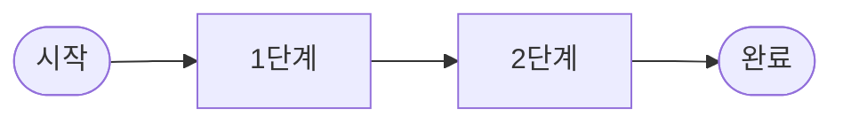

<!--
━━━━━━━━━━━━━━━━━━━━━━━━━━━━━━━━━━━━━━━━━━━━━━━━━━━━━━━━━━━━━━━━━━━━━━━━━━━
하네스 문서 템플릿  —  이 파일을 harnesses/<하네스이름>.md 로 복사해 사용하세요.

작성 가이드 (읽고 지우세요):
  • 각 섹션의 <!-- 주석 --> 는 작성 안내입니다. 채운 뒤 주석은 삭제하세요.
  • "(선택)" 표시 섹션은 해당될 때만 넣습니다. 단순 도구엔 부담 주지 마세요.
  • 예시는 특정 프로젝트가 아니라 **누구나 이해되는 범용 상황**으로 적으세요.
  • 검증 상태는 정직하게: 직접 써봤으면 ✅ 써봄, 문서/코드만 봤으면 🔍 조사만.
  • 콜아웃 표기 관례 — 문서 전체에서 통일:
        > ⚠️  주의·함정·오해하기 쉬운 동작
        > 💡  팁·권장
        > 🔁  반복/루프 흐름
  • 자세한 절차는 ../CONTRIBUTING.md 참고.
━━━━━━━━━━━━━━━━━━━━━━━━━━━━━━━━━━━━━━━━━━━━━━━━━━━━━━━━━━━━━━━━━━━━━━━━━━━
-->

# <하네스 이름>

> <TL;DR — 이게 뭐고, 사용자에게 뭘 해주는가. 딱 1문장.>

| 카테고리 | 제작자 | 라이선스 | 지원 에이전트 | 검증 상태 | 최종 업데이트 |
|---|---|---|---|---|---|
| <A~D 중 택1> | <제작자/조직> | <MIT 등> | <Claude Code, …> | <✅ 써봄 / 🔍 조사만> | <YYYY-MM-DD> |

<!--
카테고리(층위) — 이 저장소의 핵심 분류. README.md 참고.
  A. 하네스 팩   : .claude/ 에 에이전트·스킬·훅·명령을 통째로 까는 올인원 세팅
  B. 방법론      : 개발 프로세스(예: 스펙→계획→구현) 하나를 강제하는 워크플로우
  C. 규율        : "스킬/절차를 반드시 먼저 쓰게" 만드는 규율 계층
  D. 네이티브    : 별도 설치 없이 에이전트에 내장된 기능
-->

## 1. 소개

<!-- [필수] 이게 무엇이고, 어떤 문제를 푸는가. 왜 존재하는가.
     위 카테고리에서 왜 그 층위인지도 한 줄로 밝혀 주세요. -->

## 2. 설치

<!-- [필수] 전제조건 + 복사해서 바로 실행 가능한 명령어. -->

```bash
# 전제조건: <예: uv, Python 3.11+, git>
# 설치 명령
```

## 3. 발동·사용법

<!-- [필수·핵심] 이 하네스의 진짜 알맹이. 아래 소제목 중 해당되는 것만 채우세요. -->

### 발동 방식

<!-- 어떻게 켜지고 불리는가. 슬래시/자연어/CLI/자동 발동 중 해당되는 것만 표로. -->

| 트리거 | 하는 일 |
|---|---|
| `/<command>` 또는 CLI 명령 | … |
| 자동(훅) / 자연어 | … |

### ⚠️ 알아둘 함정 (선택)

<!-- (선택) 오해하기 쉬운 동작이 있으면 콜아웃으로. 없으면 이 소제목째 삭제.
     예: "자동인 줄 알았는데 실제 실행은 모델 판단이다" 같은 것. -->

> ⚠️ …

### 워크플로우 흐름도 (선택)

<!-- (선택) 여러 단계에 걸쳐 발동되는 하네스면 흐름도가 이해를 크게 돕습니다.
     단순 도구(명령 하나짜리 등)면 이 소제목째 삭제하세요.
     원칙: 세로로 길어지지 않게 `flowchart LR`(가로) + 노드는 최소로.
     GitHub은 ```mermaid 코드블록을 자동 렌더링합니다. -->



### 주요 명령·구성요소 상세

<!-- [필수] 명령/스킬/구성요소를 하나씩 [이름 — 설명 → 발동 예시] 블록으로.
     표보다 블록이 스캔하기 좋습니다. 슬래시가 있으면 '명령 + 부연설명'을 붙인
     실제 예시를 보여주고, 가능하면 자연어 예시도 함께. -->

**`<이름>`** — <이 명령/구성요소가 하는 일 한 줄.>
- **슬래시(+부연)**: `/<command> <상황 맥락을 이어 붙인 실제 예시>`
- **자연어**: "<스킬 이름 없이 말로 유도하는 예시>"

## 4. 언제 쓰나 / 언제 안 쓰나

<!-- [필수] 추천 유스케이스와 안티케이스. -->

- **쓰면 좋을 때**: …
- **안 쓰는 게 나을 때**: …

## 5. 주의 · 트레이드오프

<!-- [필수] 토큰 비용, 다른 하네스와의 충돌(훅/스킬 이름 겹침), 유지보수 부담,
     학습 곡선 등 실사용에서 물리는 부분을 솔직하게. 이게 단순 링크 모음과 다른 점입니다. -->

## 6. 함께 보기

<!-- (선택) 관련·대체 하네스, 궁합이 좋은/겹치는 도구. 이 저장소 내 다른 문서로 링크. -->

## 7. 출처

<!-- [필수] 공식 저장소, 공식 문서, 참고한 글의 링크. -->

- 
